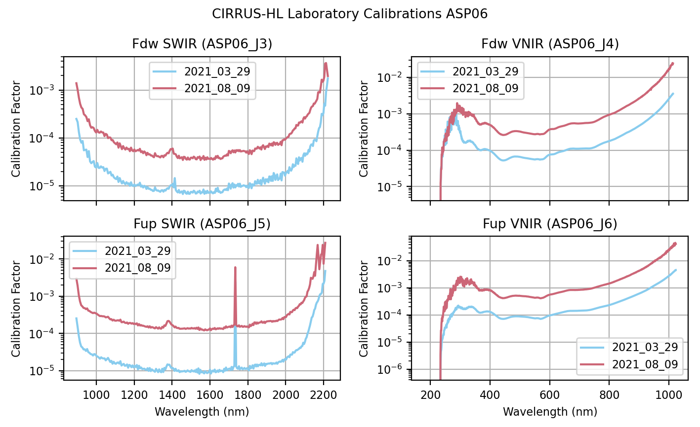
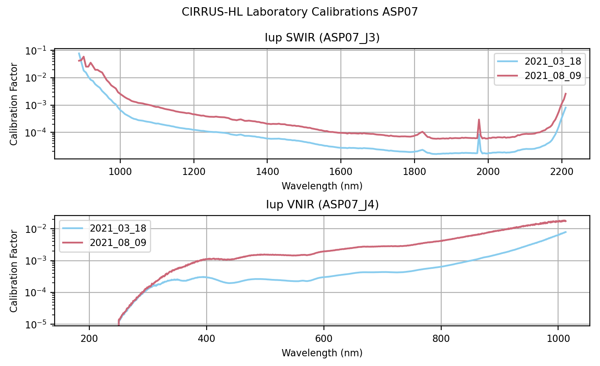

Analysis
=========

Here each analysis script is described in a short summary and by its doc string.

cirrus_hl_campaign_analysis.py
------------------------------

.. automodule:: analysis.cirrus_hl_campaign_analysis
   :members:

cirrus_hl_case_study_20210625a.py
----------------------------------

.. automodule:: analysis.cirrus_hl_case_study_20210625a
   :members:

cirrus_hl_case_study_20210629a.py
----------------------------------

.. automodule:: analysis.cirrus_hl_case_study_20210629a
   :members:

cirrus_hl_case_study_20210712a.py
----------------------------------

.. automodule:: analysis.cirrus_hl_case_study_20210712a
   :members:

cirrus_hl_case_study_20210715a.py
----------------------------------

.. automodule:: analysis.cirrus_hl_case_study_20210715a
   :members:

cirrus_hl_overview.py
---------------------

.. automodule:: analysis.cirrus_hl_overview
   :members:

cirrus_hl_smart_compare_lab_calibs.py
-------------------------------------

.. automodule:: analysis.cirrus_hl_smart_compare_lab_calibs
   :members:

Results
^^^^^^^^

   Comparison of the two irradiance laboratory calibrations of the four spectrometers in the ASP06 unit of HALO-SMART.

   Comparison of the two radiance laboratory calibrations of the two spectrometers in the ASP07 unit of HALO-SMART.

smart_analysis.py
---------------------

.. automodule:: analysis.smart_analysis
   :members:

smart_cosine_calibration.py
---------------------------

.. automodule:: analysis.smart_cosine_calibration
   :members:

smart_cosine_calibration_v2.py
------------------------------

.. automodule:: analysis.smart_cosine_calibration_v2
   :members:

smart_effective_receiving_area.py
---------------------------------

.. automodule:: analysis.smart_effective_receiving_area
   :members:
